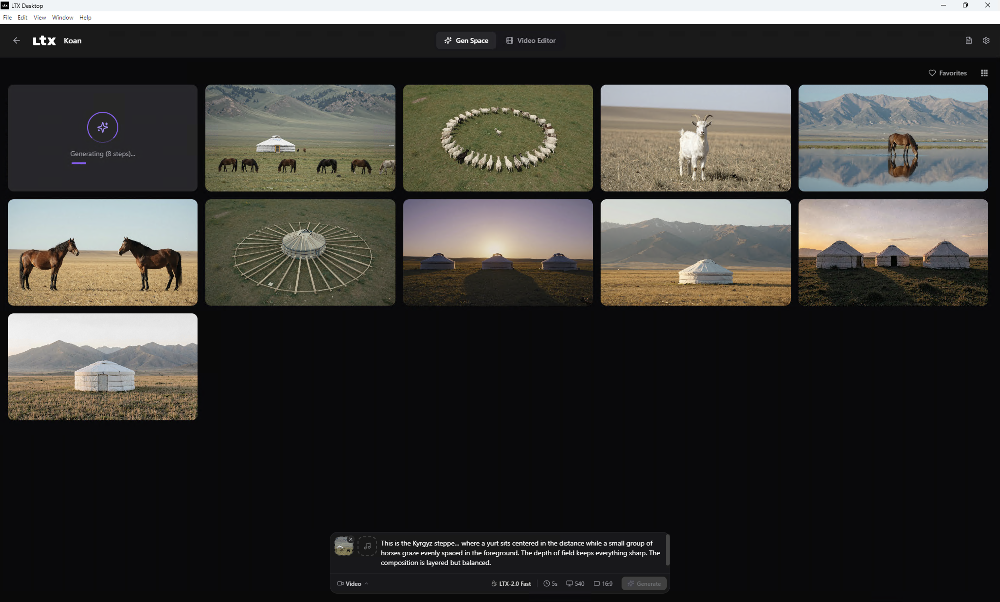
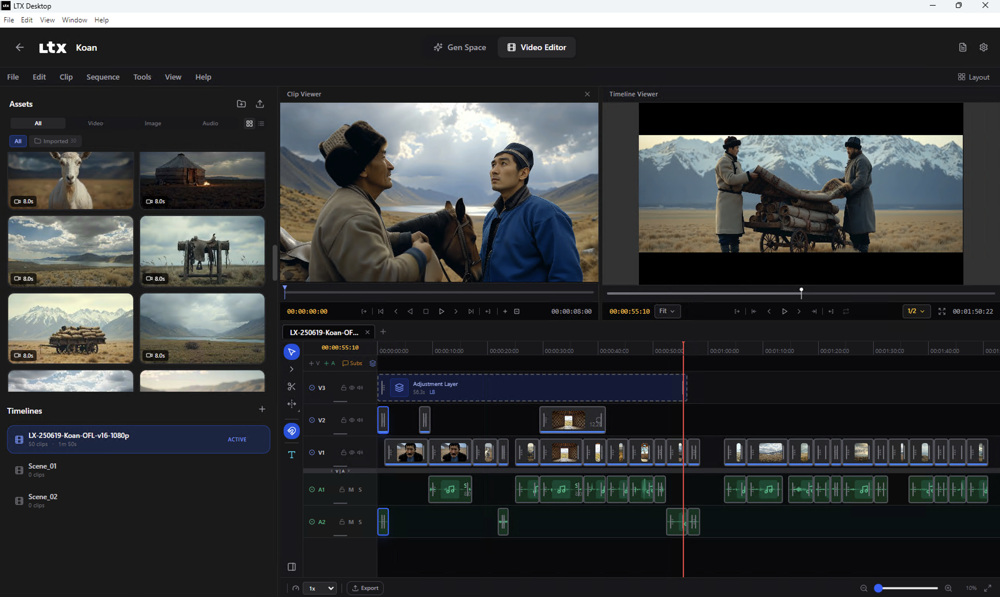
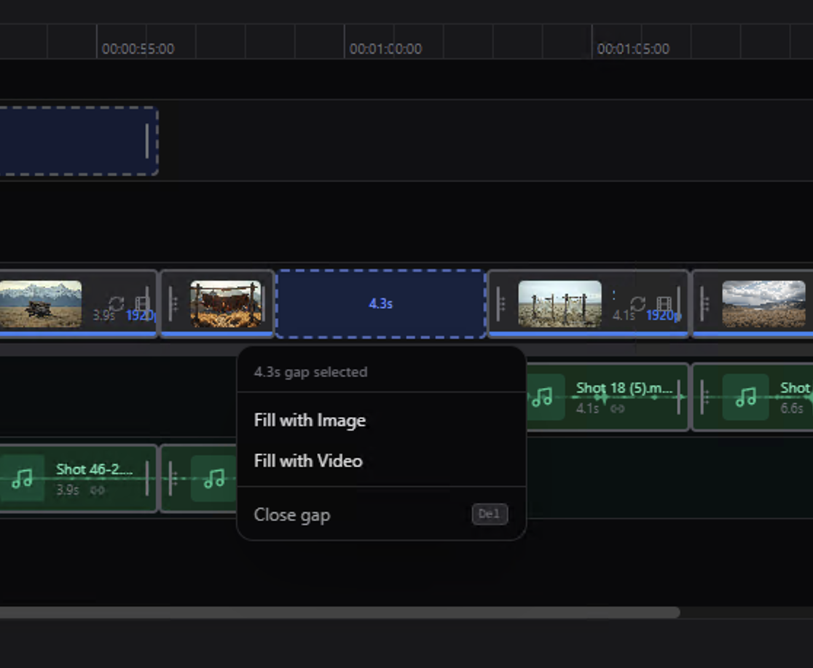
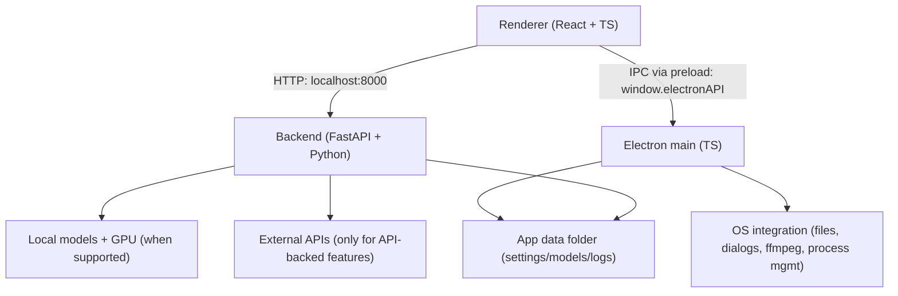

# LTX Desktop

LTX Desktop is an open-source desktop app for generating videos with LTX models - locally on supported Windows NVIDIA GPUs and on Linux source/dev setups backed by WanGP, with an API mode for unsupported hardware and macOS.

> **Status: Beta.** Expect breaking changes.
> Frontend architecture is under active refactor; large UI PRs may be declined for now (see [`CONTRIBUTING.md`](docs/CONTRIBUTING.md)).

**This LTX Desktop fork powered by WanGP reduces the VRAM requirements from 32 GB to 6 GB.**

Check the WanGP repo for more information (docs, Discord, and more): https://github.com/deepbeepmeep/Wan2GP

## What do you want to make?

Home offers two entry points that share one engine and one project model:

- **Quick video** — describe an idea (an assistant can draft the prompt when
  an AI key is configured), pick model/length, generate a clip. From the
  result: *Generate again*, *Save to project*, *Open in Video Editor*, or
  **Edit in Film Maker**, which turns the clip into a film project as
  Scene 1 / Shot 1 / version 1 with prompt, negative prompt, model,
  resolution, duration, fps, seed and output preserved.
- **Filmmaker Studio** — a project's Storyboard tab (below).

Overview: [`docs/FILMMAKING.md`](docs/FILMMAKING.md).

## Filmmaking Studio

This build turns LTX Desktop into a local AI filmmaking workstation. Every
project has a **Storyboard** tab (between Gen Space and Video Editor) where a
film goes from script to timeline without leaving the app:

0. **Build Film with AI** — describe the idea and get an editable plan
   (characters, locations, scenes, shots with framing and duration) to apply
   as a draft storyboard; works offline with a deterministic planner.
1. Write or import a **script**; generate a draft storyboard from it (a
   deterministic offline parser, or the AI Director model for AI
   cinematography).
2. Define reusable **characters, locations, props and styles** once — every
   shot that references them inherits their look, and continuity checks warn
   about drift (wardrobe changes, location mismatches, missing references).
3. Open any shot in the native 3D **Shot Composer**: pose articulated
   figures, pick shot size / camera angle / elevation / composition presets
   (the camera is solved for you), set up over-the-shoulder relationships,
   choose a camera move, and **Capture** a reference frame.
4. **Generate Preview** (fast, clamped settings) or **Generate Final**
   (quality profile: Fast Preview / Balanced / Quality / Custom, recommended
   per GPU) through the existing WanGP/LTX pipeline — the capture conditions
   the generation. One production queue with pause/resume, per-job cancel
   and prioritize, live progress and restart recovery; versions are kept
   per shot with compare/promote/retry.
5. Continuity levels (good / minor / significant / broken) on every card,
   with one-click fixes in the shot drawer.
6. Approve shots and **Send to Timeline** — outputs land in the existing
   Video Editor for assembly and export. **Export**/**Import** `.ltxfilm`
   packages move a whole film between machines.
7. Or type instructions to the **AI Director** bar ("six second medium OTS
   shot, Sarah foreground, slow push-in") — it runs tool calls against the
   same storyboard state the UI edits, and every reply can show exactly what
   context was sent. Powered by **OpenRouter**, **Claude**, **Grok**,
   **Gemini**, or a **local OpenAI-compatible server** (LM Studio, Ollama,
   vLLM) — pick provider and model from the chips in the chat itself, next to
   the Video and Image model pickers. Everything else works without any AI
   key.

Rendering is just as pluggable: **local** by default (WanGP bridge, the LTX
API or the local LTX pipeline), or **fal**, **WaveSpeed** and **Replicate**
with a key — hosted jobs run through the same queue, versions and export as
local ones.

The **Models** sub-tab opens on the **Model Library**: one searchable catalog
of every text, image and video model this app can use — local weights, an
Ollama or OpenAI-compatible server's models, and each configured hosted
provider — with downloads for the ones that run on this machine and an honest
statement of whether the fully offline set is complete. *Installed & GPU*
keeps the detected GPU and VRAM, which models fit it, their real on-disk
sizes, quality profiles, and remove/download for the host's own weights. A
**Simple / Advanced** toggle hides the power-user surfaces for a first film.

**Fully offline** is a supported path: local video/image weights plus a local
text server covers the whole workflow with no network at all
([`docs/AI_PROVIDERS.md`](docs/AI_PROVIDERS.md)).

Docs: [Filmmaking overview](docs/FILMMAKING.md) ·
[Storyboard](docs/STORYBOARD.md) ·
[Shot Composer](docs/SHOT_COMPOSER.md) ·
[AI Director](docs/AI_DIRECTOR.md) ·
[AI providers & Model Library](docs/AI_PROVIDERS.md) ·
[UI-only dev mode](docs/UI_ONLY_MODE.md) ·
[OpenRouter](docs/OPENROUTER.md) ·
[Generation Pipeline](docs/GENERATION_PIPELINE.md) ·
[Continuity](docs/CONTINUITY.md) ·
[Project format & packages](docs/PROJECT_FORMAT.md) ·
[Architecture](docs/FILMMAKING_INTEGRATION_ARCHITECTURE.md) ·
[Upstream attribution](docs/INTEGRATED_UPSTREAMS.md) ·
[Hardening audit](docs/FINAL_HARDENING_AUDIT.md) ·
[RC final report](docs/RC_FINAL_REPORT.md) ·
[RTX 4070 test matrix](docs/RTX_4070_TEST_MATRIX.md)

### Building installers

**Windows** — `pnpm build:win` (on Windows) runs the full pipeline —
typecheck, frontend build, Python preparation, then electron-builder — and
produces the NSIS installer **`release/LTX Desktop-Setup.exe`**. The
installed app downloads its Python runtime on first launch (validated
against the bundled `python-deps-hash.txt`). Builds are **unsigned by
default** so personal builds just work; release builds with Azure Trusted
Signing credentials in the environment (or `create-installer.ps1 -Signed`)
automatically use `electron-builder-signed.yml`.

**Linux** — `bash scripts/local-build.sh --platform linux` produces
**`release/LTX Desktop-<version>-x86_64.AppImage`** (self-contained:
`chmod +x` and run) and **`release/LTX Desktop-<version>-amd64.deb`**
(`sudo apt install ./…deb`, then launch `ltx-desktop`). The Python runtime
and all locked dependencies (including CUDA PyTorch from the cu128 index)
are prepared by `scripts/prepare-python.sh` and bundled into the package,
mirroring the macOS layout. `LTX_PYTHON_DEPS=skip` builds a runtime-only
bundle for CI/packaging smoke tests — never ship that to users.

**macOS** — `pnpm build:mac` produces the DMG as before.

## Windows WanGP Quick Start

Use one of these two setup paths for local WanGP-backed generation on Windows.

Before running any `pnpm` command, make sure `pnpm` is installed and available in `PATH`.

Prerequisites:

- Node.js 18+ from https://nodejs.org/
- `pnpm`, usually enabled with Corepack:

```bash
corepack enable
corepack prepare pnpm@latest --activate
pnpm -v
```

If `corepack` is unavailable but Node.js is already installed, you can install `pnpm` with:

```bash
npm install -g pnpm
pnpm -v
```

### 1. Wan2GP not installed yet

`pnpm setup:dev:win` clones `Wan2GP/` into this repository, installs the backend dependencies, and prepares a plug-and-play local setup.

```bash
pnpm setup:dev:win
pnpm dev
```

The desktop backend will prefer the repo-local checkout at `.\Wan2GP`.

### 2. Wan2GP already installed elsewhere

If you already have a working Wan2GP checkout and want LTX Desktop to reuse it, do not keep a local `.\Wan2GP` subfolder in this repo.

`WANGP_ROOT` is an environment variable that must point to the root folder of your existing Wan2GP checkout, meaning the folder that contains `wgp.py`.

Examples:

- Windows `cmd.exe`:

```bat
set WANGP_ROOT=D:\Wan2GP
```

- Windows PowerShell:

```powershell
$env:WANGP_ROOT = "D:\Wan2GP"
```

Set `WANGP_ROOT` before running setup. `pnpm setup:dev:win` will then reuse that checkout and install its `requirements.txt` into the LTX Desktop backend venv.

```bash
set WANGP_ROOT=D:\Wan2GP
pnpm setup:dev:win
pnpm dev
```

If you prefer the manual path instead of `pnpm setup:dev:win`, install the external Wan2GP requirements into the backend venv yourself after `uv sync`:

```bash
set WANGP_ROOT=D:\Wan2GP
pnpm install
cd backend
uv sync --extra dev
uv pip install --python .venv\Scripts\python.exe -r %WANGP_ROOT%\requirements.txt
cd ..
pnpm dev
```

The backend still runs in LTX Desktop's own `backend/.venv` unless you explicitly override it with `LTX_BACKEND_PYTHON`.

If both are present, LTX Desktop uses the local `.\Wan2GP` checkout first and falls back to `WANGP_ROOT` only when no local subfolder is available.

If you want `WANGP_ROOT` to persist across new Windows terminals, you can set it permanently with:

- `cmd.exe`:

```bat
setx WANGP_ROOT D:\Wan2GP
```

- PowerShell:

```powershell
[Environment]::SetEnvironmentVariable("WANGP_ROOT", "D:\Wan2GP", "User")
```

## Linux WanGP Quick Start

Linux support in this fork currently targets running from source/dev with WanGP. This README does not claim an official packaged Linux release for the fork.

Prerequisites:

- Node.js 18+
- `pnpm`
- `uv`
- `git`
- NVIDIA GPU with CUDA support
- `ffmpeg`

If you already have a Wan2GP checkout, point `WANGP_ROOT` to it before setup:

```bash
export WANGP_ROOT=/path/to/Wan2GP
pnpm setup:dev:linux
pnpm dev
```

If `WANGP_ROOT` is not set, `pnpm setup:dev:linux` will prepare a repo-local `Wan2GP/` checkout for you.

<p align="center">
  
</p>

<p align="center">
  
</p>

<p align="center">
  
</p>

## Features

- Text-to-video generation
- Image-to-video generation
- Audio-to-video generation
- Video edit generation (Retake)
- Video Editor Interface
- Video Editing Projects

## Local vs API mode

| Platform / hardware | Generation mode | Notes |
| --- | --- | --- |
| Windows + CUDA GPU with **as low as 6 GB VRAM with WanGP** | Local generation | Downloads model weights locally |
| Windows (no CUDA, low VRAM, or unknown VRAM) | API-only | **LTX API key required** |
| macOS (Apple Silicon builds) | API-only | **LTX API key required** |
| Linux + CUDA GPU + WanGP checkout | Local generation | Source/dev setup supported in this fork |
| Linux without WanGP bridge | API-only | **LTX API key required** |

In API-only mode, available resolutions/durations may be limited to what the API supports.

## System requirements

### Windows (local generation)

- Windows 10/11 (x64)
- NVIDIA GPU with CUDA support and as low as 6 GB VRAM with WanGP
- 16 GB+ RAM (32 GB recommended)
- Plenty of free disk space for model weights and outputs

### macOS (API-only)

- Apple Silicon (arm64)
- macOS 13+ (Ventura)
- Stable internet connection

### Linux (source/dev with WanGP)

- Modern x64 Linux distribution
- NVIDIA GPU with CUDA support
- `ffmpeg`
- A Wan2GP checkout available locally or via `WANGP_ROOT`

## Install

1. Windows: download the latest installer from GitHub Releases: [Releases](../../releases), or build it yourself with `pnpm build:win` (see **Building installers**)
2. Linux: the AppImage/.deb from Releases or `bash scripts/local-build.sh --platform linux`; or the source/dev setup described in **Linux WanGP Quick Start** / **Development (quickstart)**
3. Launch **LTX Desktop** and complete first-run setup

## First run & data locations

LTX Desktop stores app data (settings, models, logs) in:

- **Windows:** `%LOCALAPPDATA%\LTXDesktop\`
- **macOS:** `~/Library/Application Support/LTXDesktop/`
- **Linux:** `$XDG_DATA_HOME/LTXDesktop/` or `~/.local/share/LTXDesktop/`

Model weights are downloaded into the `models/` subfolder (this can be large and may take time).

On first launch you may be prompted to review or accept model license terms (license text is fetched from Hugging Face and requires internet).

Text encoding: to generate videos you must configure text encoding:

- **LTX API key** (cloud text encoding) - **text encoding via the API is completely free** and highly recommended to speed up inference and save memory. Generate a free API key at the [LTX Console](https://console.ltx.video/). [Read more](https://ltx.io/model/model-blog/ltx-2-better-control-for-real-workflows).
- **Local Text Encoder** (extra download; enables fully local operation on supported Windows and Linux WanGP setups) - if you do not wish to generate an API key, you can encode text locally via the settings menu.

## API keys, cost, and privacy

### LTX API key

The LTX API is used for:

- **Cloud text encoding and prompt enhancement** - **free**; text encoding is highly recommended to speed up inference and save memory
- API-based video generations (required on macOS and on unsupported Windows/Linux hardware) - paid
- Retake - paid

An LTX API key is required in API-only mode, but optional on Windows and Linux local WanGP mode if you enable the Local Text Encoder.

Generate a free API key at the [LTX Console](https://console.ltx.video/). Text encoding is free; video generation API usage is paid. [Read more](https://ltx.io/model/model-blog/ltx-2-better-control-for-real-workflows).

When you use API-backed features, prompts and media inputs are sent to the API service. Your API key is stored locally in your app data folder - treat it like a secret.

### fal API key (optional)

Used for Z Image Turbo text-to-image generation in API mode, and as a hosted
image/video provider for film shots. When enabled, generation requests are
sent to fal.ai.

Create an API key in the [fal dashboard](https://fal.ai/dashboard/keys).

### WaveSpeed / Replicate API keys (optional — hosted generation)

Alternative hosted image/video providers for film shots, selectable per
project or app-wide in **Settings → API Keys**. Prompts and any conditioning
image are sent to the provider you select; nothing is sent while the media
provider is **Local**. See
[`docs/AI_PROVIDERS.md`](docs/AI_PROVIDERS.md).

### OpenRouter API key (optional — AI Director)

Powers the AI Director, Build Film with AI, AI Storyboard, prompt refinement
and the Quick-video assistant with any model on openrouter.ai. Set it in
**Settings → API Keys → OpenRouter** (validated on save, models listed for
per-role selection) or export `OPENROUTER_API_KEY`. The key is kept by the
local backend in its settings file, is never returned to the UI or written
into project files, and only travels in the `Authorization` header to
`https://openrouter.ai/api/v1/*`. Prompts, the compact project summary and
tool results are sent to the selected model. Details and limits:
[`docs/OPENROUTER.md`](docs/OPENROUTER.md).

### Gemini API key (optional)

Alternative AI Director provider; also used for AI prompt suggestions when
filling timeline gaps. When enabled, prompt context and frames may be sent
to Google Gemini.

### Claude / Grok API keys (optional — AI Director)

Anthropic and xAI are interchangeable AI Director providers with the same
handling as OpenRouter: the key lives only in the local backend's settings
file, never reaches the UI or a project file, and travels only to that
vendor's own API. Set them in **Settings → API Keys**.

### No key at all

The AI Director also runs against a **local OpenAI-compatible server**
(LM Studio, Ollama, vLLM): set the base URL and model in
**Settings → API Keys → Local / OpenAI-compatible**. Combined with local
weights, nothing leaves the machine.

## Architecture

LTX Desktop is split into three main layers:

- **Renderer (`frontend/`)**: TypeScript + React UI.
  Calls the local backend over HTTP at `http://localhost:8000`.
  Talks to Electron via the preload bridge (`window.electronAPI`).
- **Electron (`electron/`)**: TypeScript main process + preload.
  Owns app lifecycle and OS integration (file dialogs, native export via ffmpeg, starting/managing the Python backend).
  Security: renderer is sandboxed (`contextIsolation: true`, `nodeIntegration: false`).
- **Backend (`backend/`)**: Python + FastAPI local server.
  Orchestrates generation, model downloads, and GPU execution.
  Calls external APIs only when API-backed features are used.



## Development (quickstart)

### Working on the UI only

If you are changing the interface and not the engine, you do not need any of
the setup below — no Python, no `uv`, no GPU, no model weights, no Electron:

```bash
pnpm install
pnpm dev:ui          # http://localhost:5173, with hot reload
```

Or build a single HTML file you can just open — no server, nothing installed,
runs straight off disk:

```bash
pnpm build:ui        # dist-ui/ltx-desktop-ui.html — double-click it
```

Both run the **same renderer** the packaged app ships, against a mock of the
backend contract, opening on a seeded demo film with scenes, shots, assets, a
script, continuity warnings and a model library. Full details and what is (and
is not) simulated: [`docs/UI_ONLY_MODE.md`](docs/UI_ONLY_MODE.md).

### The full app

Prereqs:

- Node.js
- `uv` (Python package manager)
- Python 3.12+
- Git

Setup:

```bash
# macOS
pnpm setup:dev:mac

# Linux
pnpm setup:dev:linux

# Windows
pnpm setup:dev:win
```

On Windows and Linux, the WanGP-backed path uses the LTX Desktop backend venv plus either a repo-local `Wan2GP/` checkout or an existing checkout pointed to by `WANGP_ROOT`. A repo-local `Wan2GP/` remains directly usable on its own if you want to run Wan2GP from the subfolder.

Run:

```bash
pnpm dev
```

Debug:

```bash
pnpm dev:debug
```

`dev:debug` starts Electron with inspector enabled and starts the Python backend with `debugpy`.

Typecheck:

```bash
pnpm typecheck
```

Backend tests:

```bash
pnpm backend:test
```

Building installers:
- See [`INSTALLER.md`](docs/INSTALLER.md)

## Telemetry

LTX Desktop collects minimal, anonymous usage analytics (app version, platform, and a random installation ID) to help prioritize development. No personal information or generated content is collected. Analytics is enabled by default and can be disabled in **Settings > General > Anonymous Analytics**. See [`TELEMETRY.md`](docs/TELEMETRY.md) for details.

## Docs

- [`INSTALLER.md`](docs/INSTALLER.md) - building installers
- [`RELEASE_CHECKLIST.md`](docs/RELEASE_CHECKLIST.md) - what must be verified before a release
- [`FILMMAKING.md`](docs/FILMMAKING.md) - filmmaking workflow overview (links to every film doc)
- [`FINAL_HARDENING_AUDIT.md`](docs/FINAL_HARDENING_AUDIT.md) - audit of what is implemented, verified, and not
- [`RC_FINAL_REPORT.md`](docs/RC_FINAL_REPORT.md) - release-candidate status, tests, installer state, remaining issues
- [`RTX_4070_TEST_MATRIX.md`](docs/RTX_4070_TEST_MATRIX.md) - GPU qualification checklist (fill in on real hardware)
- [`TELEMETRY.md`](docs/TELEMETRY.md) - telemetry and privacy
- [`backend/architecture.md`](backend/architecture.md) - backend architecture
- [`backend/WANGP_BACKEND.md`](backend/WANGP_BACKEND.md) - WanGP bridge configuration

## Contributing

See [`CONTRIBUTING.md`](docs/CONTRIBUTING.md).

## License

Apache-2.0 - see [`LICENSE.txt`](LICENSE.txt).

Third-party notices (including model licenses/terms): [`NOTICES.md`](NOTICES.md).

Model weights are downloaded separately and may be governed by additional licenses/terms.
